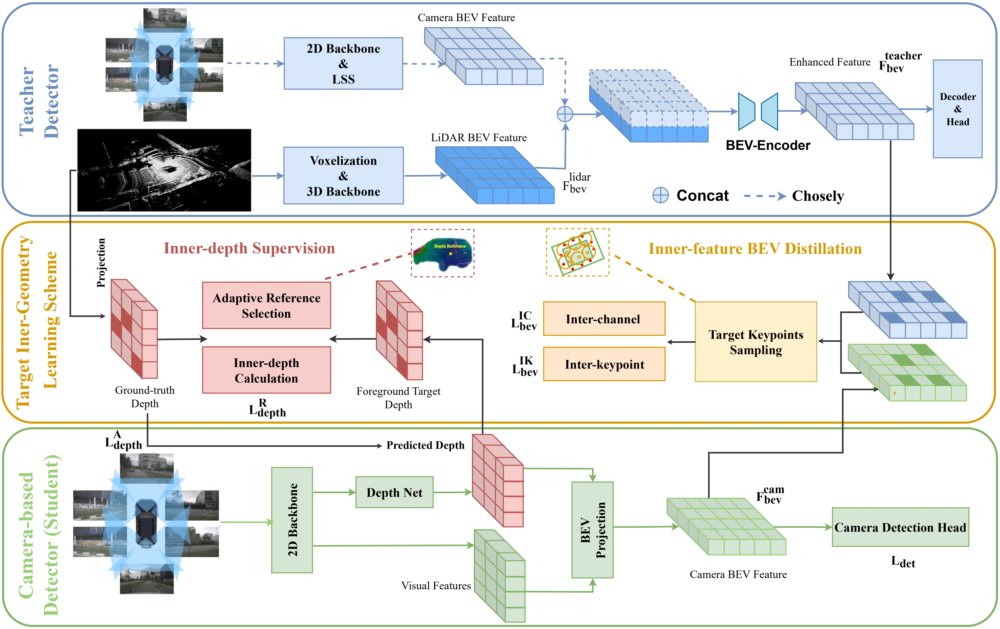

# TiGDistill-BEV: Multi-view BEV 3D Object Detection via Target Inner-Geometry Learning Distillation

Official implementation of "TiGDistill-BEV: Multi-view BEV 3D Object Detection via Target Inner-Geometry Learning Distillation".

## Introduction

We introduce the TiGDistill-BEV, a novel approach that bridges this gap by
distilling the Target Inner-Geometry learning scheme to enhance camera-based BEV detectors from both depth and BEV
feature by leveraging the diverse modalities. We propose two key modules: an inner-depth supervision module to learn the low-level relative depth relations within objects which equips
detectors with a deeper understanding of object-level spatial structures, and an inner-feature BEV distillation module to transfer high-level semantics of different keypoints
within foreground targets. To further alleviate the domain  gap, we incorporate both inter-channel and inter-keypoint distillation to model feature similarity. Extensive experiments
on the nuScenes benchmark demonstrate that TiGDistillBEV significantly **boosts camera-based** detectors achieving a state-of-the-art with **62.8%** NDS.
<p align="center">
  
</p>

## Main Results
| Method | mAP      | NDS  | 
|--------|----------|------|
| [**TiGDistill-BEV-R50**](configs/tigdistill_bev/tig_bev-r50.py)  | 33.8     | 37.5 |
| [**TiGDistill-BEV4D-R50**](configs/tigdistill_bev/tig_bev4d-r50.py) | 36.6     | 46.1 |
| [**TiGDistill-PillarNext-R50-CBGS**](configs/tigdistill_bev/tig_bev4d-r101-CBGS.py) | 38.7   | 50.4 |
| [**TiGDistill-BEVFusion-R50-CBGS**](configs/tigdistill_bev/tig_bev4d-r101-CBGS.py) | 39.6   | 51.1 |

We provide the model and log of TiG-BEV4D-R101-CBGS.

| Method                                                                          | mAP      | NDS     |  Model | Log
|---------------------------------------------------------------------------------|----------|---------|--------|-------
| [**TiGDistill-BEV4D-R101-CBGS**](configs/tigdistill_bev/tig_bev4d-r101-CBGS.py) | 44.0   | 54.4   |[Google](https://drive.google.com/file/d/1sJFeI9byxHmNWrTCzeRcKOYzgGKXrgq2/view?usp=sharing)| [Google](https://drive.google.com/file/d/1sJFeI9byxHmNWrTCzeRcKOYzgGKXrgq2/view?usp=sharing)


## Quick Start

### Installation
Please see [getting_started.md](https://github.com/HuangJunJie2017/BEVDet/blob/master/docs/getting_started.md) in BEVDet.

### Data Preparation

#### nuScenes

Please follow the instructions from [here](https://github.com/open-mmlab/mmdetection3d/blob/master/docs/en/datasets/nuscenes_det.md) to download and preprocess the nuScenes dataset. Please remember to download both detection dataset and the map extension (for BEV map segmentation). After data preparation, you will be able to see the following directory structure (as is indicated in mmdetection3d):

```
TiGDistill-BEV
├── mmdet3d
├── tools
├── configs
├── data
│   ├── nuscenes
│   │   ├── maps
│   │   ├── samples
│   │   ├── sweeps
│   │   ├── v1.0-test
|   |   ├── v1.0-trainval
│   │   ├── nuscenes_database
│   │   ├── nuscenes_infos_train.pkl
│   │   ├── nuscenes_infos_val.pkl
│   │   ├── nuscenes_infos_test.pkl
│   │   ├── nuscenes_dbinfos_train.pkl

```

### Train & Evaluate in Command Line

**Now we only support training and evaluation with gpu. Cpu only mode is not supported.**

Use the following command to start a distributed training using 4 GPUs. The models and logs will be saved to ```work_dirs/CONFIG_NAME```

```bash
python -m torch.distributed.launch --nproc_per_node=4 ./tools/train.py CONFIG_PATH
```

For distributed testing with 4 gpus,

```bash
bash dist_train.sh CONFIG_PATH 4 
or 
python -m torch.distributed.launch --nproc_per_node=4 ./tools/dist_test.py CONFIG_PATH --work_dir work_dirs/CONFIG_NAME --checkpoint work_dirs/CONFIG_NAME/latest.pth 
```

For testing with one gpu and see the inference time,

```bash
bash dist_train.sh CONFIG_PATH  work_dirs/CONFIG_NAME/latest.pth 4 
or 
python ./tools/dist_test.py CONFIG_PATH work_dirs/CONFIG_NAME/latest.pth --work_dir work_dirs/CONFIG_NAME 
```

## Acknowledgement
We sincerely thank these great open-sourced work below:
* [open-mmlab](https://github.com/open-mmlab) 
* [CenterPoint](https://github.com/tianweiy/CenterPoint)
* [Lift-Splat-Shoot](https://github.com/nv-tlabs/lift-splat-shoot)
* [BEVDet](https://github.com/HuangJunJie2017/BEVDet/tree/master)
* [BEVDepth](https://github.com/Megvii-BaseDetection/BEVDepth)
* [BEVFusion](https://github.com/mit-han-lab/bevfusion)  


